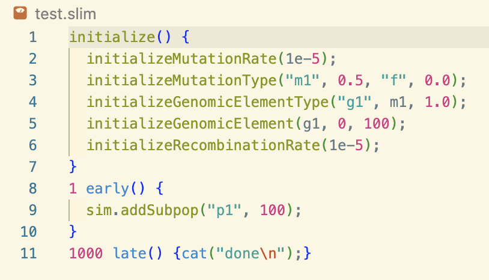
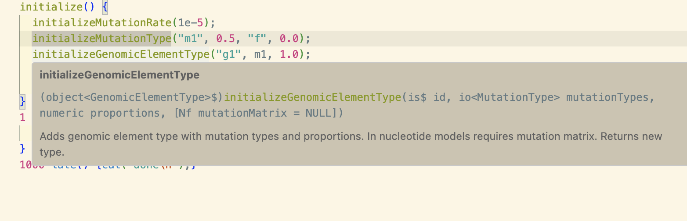
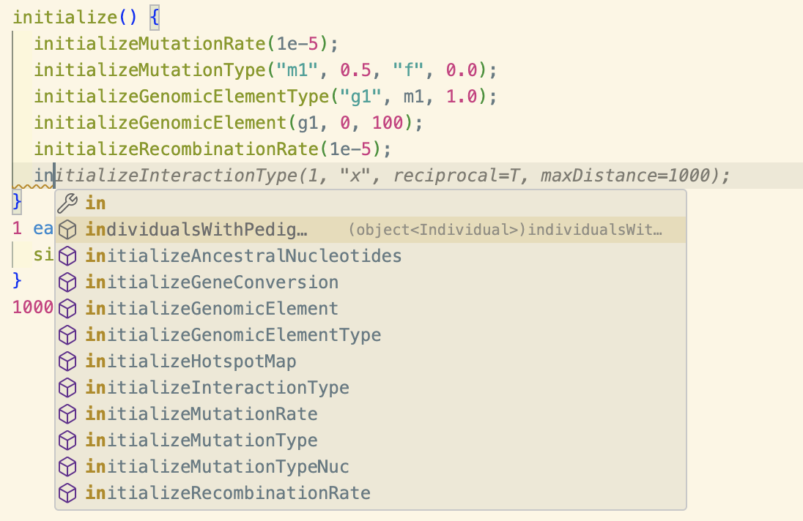
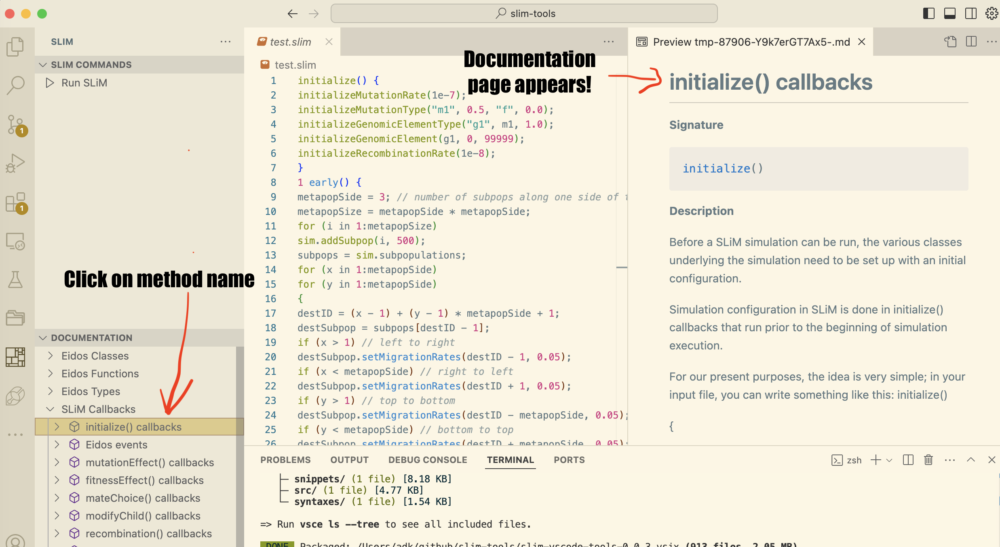
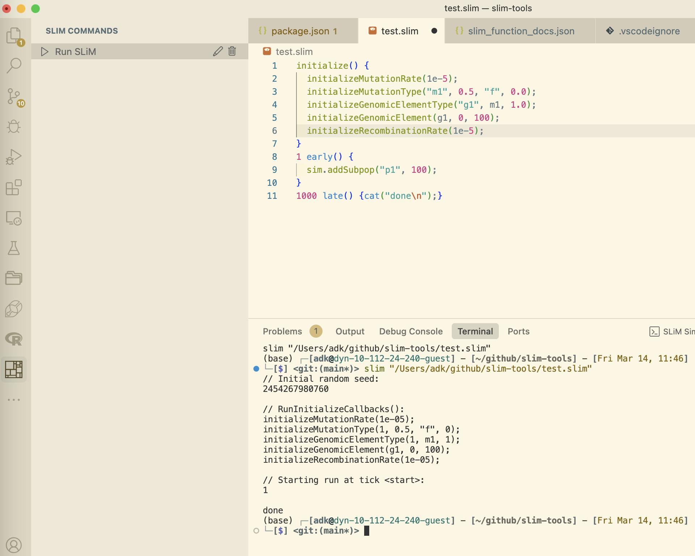

# SLiM VS Code Extension

`slim-vscode-tools` is a Visual Studio Code extension designed to provide comprehensive support for the SLiM simulation package. This extension includes features such as syntax highlighting, snippets, IntelliSense, and commands to enhance the development experience for SLiM scripts.

## ✨ Features

### Syntax Highlighting
Provides syntax highlighting for SLiM scripts using a TextMate grammar. This includes:
- Line and block comments
- Double and single-quoted strings with escape sequences
- Control keywords (`if`, `else`, `for`, `while`, `function`, `return`, `break`, `continue`)
- SLiM-specific keywords (`initialize`, `sim`, `initializeSLiMOptions`, etc.)
- Numeric constants
- Language variables (`this`, `self`)
- Function definitions and parameters

### Hover Information

Shows a tooltip with the function signature and complete documentation from the SLiM help system.

### Auto-completion

Provides auto-completion for SLiM keywords, functions, and variables, showing a tooltip with the function signature and description.

### Syntax Checking
Provides real-time syntax validation for SLiM scripts:
- Brace matching and block structure validation
- Semicolon checking for statements
- SLiM-specific block structure validation (initialize, early, late, fitness)
- Generation-prefixed block validation (e.g., "1000 late()")
- Function parameter validation
- Smart error reporting with inline diagnostics
- Support for multi-line code blocks

### Snippets
Includes a set of useful snippets to speed up the development process. For example:
- `initWF`: Initializes a basic Wright-Fisher model.
- `initSel`: Initializes a model with selection.

### IntelliSense
Provides basic IntelliSense features such as auto-completion for keywords, functions, and variables.

### Eidos File Support
Full support for `.eidos` files with appropriate feature filtering:
- Eidos files receive only Eidos-specific completions and documentation
- Dynamic status bar shows "Run Eidos" or "Run SLiM" based on active file

### Commands
Adds a custom view in the activity bar with a command to run SLiM or Eidos scripts:
- **Run SLiM**: Executes the currently open SLiM script using the SLiM interpreter.
- **Run Eidos**: Executes the currently open Eidos script using the Eidos interpreter.

### Documentation Tree View
Offers a tree view to the sidebar that shows the full hierarchy of classes, methods, properties, etc.,
as presented in the native `SLiMgui` help system.
The documentation pages are displayed in a hierarchical, tree view format, where opening
subsequent tabs shows the documentation for the selected item.
Clicking on individual items in the tree view such as methods or properties opens the corresponding
section of the slim documentation in a webview.

### Status Bar Integration
Adds a status bar button to quickly run the SLiM script in the active editor.
Also adds a command to run the SLiM script in Activity Bar.

## Requirements

- Visual Studio Code version 1.96.0 or higher
- SLiM interpreter installed and accessible in your system's PATH or configured in the extension settings

## Installation

### From the VS Code Marketplace (Recommended)
1. Open VS Code
2. Go to Extensions View by pressing Ctrl+Shift+X (Windows/Linux) or Cmd+Shift+X (Mac)
3. Search for "slim-tools"
4. Click Install

### From Source
1. Clone the repository
2. Run `npm install` to install the dependencies
3. Run `npm run package` to package the extension
4. Install the resulting package with `code --install-extension slim-vscode-tools-<current-version-number>-.vsix` (this assumes you've installed the `vscode` command line tool)

### From GitHub Releases
1. Download the latest `.vsix` file from the [GitHub releases](https://github.com/slim-community/slim-vscode-tools/releases)
2. Install via command line: `code --install-extension slim-vscode-tools-<version>.vsix`
3. Or install from within VS Code: Extensions View → More Actions (⋮) → "Install from VSIX..."

## Extension Settings

This extension contributes the following settings:

* `slimTools.slimInterpreterPath`: Path to the SLiM interpreter (e.g., `/usr/local/bin/slim` or `C:\\Users\\YourName\\slim.exe`).
* `slimTools.formatting.tabSize`: Number of spaces per indentation level (default: 4).
* `slimTools.formatting.insertSpaces`: Use spaces instead of tabs (default: true).
* `slimTools.formatting.maxConsecutiveBlankLines`: Maximum consecutive blank lines (default: 2).

## Diagnostic Features

The extension provides real-time diagnostic feedback for:
- Syntax errors (mismatched braces, missing semicolons)
- SLiM-specific block structure issues
- Function parameter validation
- Code style recommendations

Diagnostics are displayed as:
- 🔴 Errors: Critical issues that need to be fixed
- 🟡 Warnings: Potential issues or style recommendations

## Known Issues

- None at the moment. Please report any issues on the [GitHub repository](https://github.com/slim-community/slim-vscode-tools/issues).

## Release Notes

### [0.0.1-beta]
Added new features:
- Real-time syntax checking and validation
- SLiM-specific block structure validation
- Enhanced error reporting with inline diagnostics
- Support for generation-prefixed blocks

### [0.0.1]
Initial release of `slim-tools` with the following features:
- Syntax highlighting for SLiM scripts
- Snippets for common SLiM patterns
- Basic IntelliSense support
- Custom view and command to run SLiM scripts
- Status bar integration

### [0.0.2]
- Full, auto-parsed SLiM documentation now appears in an object-oriented aware way
- Hover / autocomplete for Classes, their properties and methods, etc. 

### [0.0.3]
- Documentation Tree view now shows the full hierarchy of classes, methods, properties, etc.
- Clicking on document item in the tree view opens the corresponding section of the slim documentation in a webview
- Improvements in semicolon handling to be more C++ like

### [0.0.4]
- This is only a number bump to include a better icon on the marketplace

### [0.0.5]
- Added GH action to auto-publish the extension to the marketplace
- altered the repo location in the package.json to point to the new location in the slim-community organization

### [0.0.6]
- Added better handling of semicolons in the editor

### [0.0.7]
- Updated documentation to SLiM v5.1
- Improved language configuration (indentation rules, folding, etc.)
- Updated link in README
- Added test simulations (and moved the existing one) into `/test-sims`
- Remove unused files

### [0.0.8]
- Refactor the language server and extension from JavaScript to TypeScript
- Boilerplate for Vitest testing system
- Small updates to syntax (slim.tmLanguage.json)
- ESLint/Prettier installed for the project
- Update .gitignore
- Fixed build configuration to compile to ./out
- Fixed documentation paths

### [0.0.9]
- Refactor: Increase modularity of language server providers and utils for future expansion
  - `server/src/` - All language server code
  - `server/src/config/` - Constants and types shared across the language server
  - `server/src/handlers/` - LSP handler setup
  - `server/src/providers/` - Individual language server feature providers (completion, hover, etc.)
  - `server/src/services/` - Documentation loading and validation services
  - `server/src/utils/` - General utilities (instance tracking, position helpers)
  - `server/src/validation/` - Structure validation scripts

### [0.0.10]

#### Major Features
- **Eidos file support**: Full language server support for `.eidos` files with appropriate feature filtering
  - Added language configuration for `.eidos` file extension in `package.json`
  - Eidos files only receive Eidos-specific completions, hover info, and documentation
- **Performance improvements**: Document caching system to reduce redundant parsing
- **Enhanced type inference**: Comprehensive type resolution for variables, constants, and expressions

#### New Utilities
- `file-type.ts`: Determines file type (`.eidos` vs `.slim`) and filters features accordingly
- `logger.ts`: Connection-aware logging system with fallback to console logging
- `document-cache.ts`: Version-aware caching system for parsed document state
- `text-processing.ts`: HTML entity decoding (using `he` library - resolves issue [#6](https://github.com/slim-community/slim-vscode-tools/issues/6)), type name cleaning, and signature formatting
- `markdown.ts`: Centralized markdown generation for hover tooltips and completion documentation
- `type-manager.ts`: Type inference engine for expressions, variables, and SLiM-specific patterns (e.g., `p1`, `m1`)
- `hover-resolvers.ts`: Modular hover resolution logic separated from provider code

#### Services
- `completion-service.ts`: Refactored completion logic into dedicated service class
  - Supports context-aware completions for methods, properties, functions, callbacks, and types
  - Integrates with type inference for better suggestions
- `documentation-service.ts`: Turned documentation retrieval and management into a service
  - Loads operator documentation from `eidos_operators.json`
  - Improved error handling and logging

#### Improvements to Existing Files

##### `instance.ts`
- Tracks pseudo-parameters (e.g., `mut`, `individual`, `subpop`) within callback scopes
- Detects model type (WF vs nonWF) from `initializeSLiMModelType()`
- Tracks defined constants, mutation types, genomic element types, interaction types, subpopulations, species, and script blocks
- Properly handles multiple active documents without race conditions

##### `handlers.ts`
- Initializes `DocumentationService` and `CompletionService` instances
- Creates `LanguageServerContext` object for passing shared state
- Registers document cache cleanup on document close

##### `hover.ts`
- Refactored to use `hover-resolvers.ts` for cleaner separation of concerns

##### `extension.ts`
- Status bar now dynamically shows "Run Eidos" or "Run SLiM" based on active file

#### Test Files
- Added `test.eidos`: Lotka-Volterra predator-prey dynamics simulator (pure Eidos implementation)
- Added unit tests for language server providers in `server/src/test`

### [0.0.11]

#### Major Features
- **Go to Definition** (`definitions.ts`): Jump to the definition of variables, functions, constants, and SLiM objects
- **Code Actions (Quick Fixes)** (`code-actions.ts`): Automated fixes for common syntax errors (missing semicolons, unmatched braces, etc.)
- **Formatting** (`formatting.ts`): Configurable document formatting for full documents or ranges
- **Find All References** (`references.ts`): Locate all usages of variables, functions, and SLiM objects
- **Folding Ranges** (`folding-range.ts`): Collapse code blocks for better navigation
- **Inlay Hints** (`inlay-hints.ts`): Inline type and parameter information

#### New Utilities
- `diagnostics.ts`: Centralized diagnostic creation utilities for consistent error reporting
- `validation-utils.ts`: Helper utilities for getting character ranges for validation diagnostics
- `eidos-function-parser.ts`: Parser for Eidos function signatures and parameter extraction
- `vector-detector.ts`: Singleton/vector type discrimination and conversion utilities for Eidos type system
- `ranges.ts`: Block range finding and comment range detection utilities for folding and navigation

#### Refactored Validation System

##### `validation-service.ts`
- Integrated with document caching system for significant performance improvement in large files
- Modular validation pipeline with clear extension points
- Prepared infrastructure for future validation modules

##### `structure.ts`
- Complete rewrite with enhanced error detection
  - Multi-line string tracking with proper escape sequence handling
  - Improved brace, bracket, and parenthesis balance tracking
  - Better detection of unclosed constructs

#### Enhanced Caching System (`document-cache.ts`)
- Implemented configurable LRU (Least Recently Used) eviction policy
- Separate caching for tracking state and diagnostics

#### Test Coverage
- **New test suites**
  - Comprehensive unit test suites for all providers
  - Existing unit tests expanded for new functionality and edge cases
  - New integration tests for testing array access, instance tracking, and tracking order
  
#### Minor Updates & Bug Fixes
- Improved `signature-help.ts` and `completion-service.ts` with new features/utils
- Fixed user-defined function handling to use the correct Eidos syntax
- Added user-defined functions to tracking for hover info, completion, and signature help
- Improve hover info behavior for class members
- Fixed subpopulation definition patterns to handle multispecies models
- Improved multi-line string handling in validation
- Removed `--passWithNoTests` flag from language server test script (tests now required to pass)

## Development notes

1. First install the dependencies with `npm install`
2. Build the project with `npm run compile`
3. If you want to clean up and remove the compiled files, run `npm run clean`
4. To build the `.vsix` file, run `npm run package`
5. To run the extension in development mode, press `F5` to open a new VS Code window with the extension loaded.

**Enjoy!**
